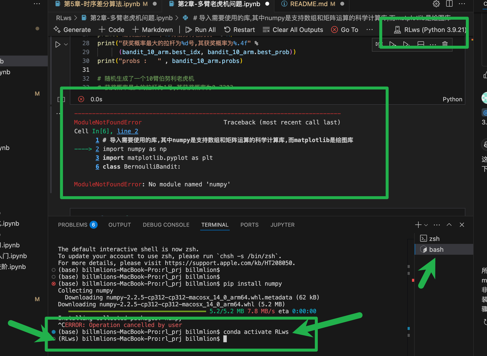
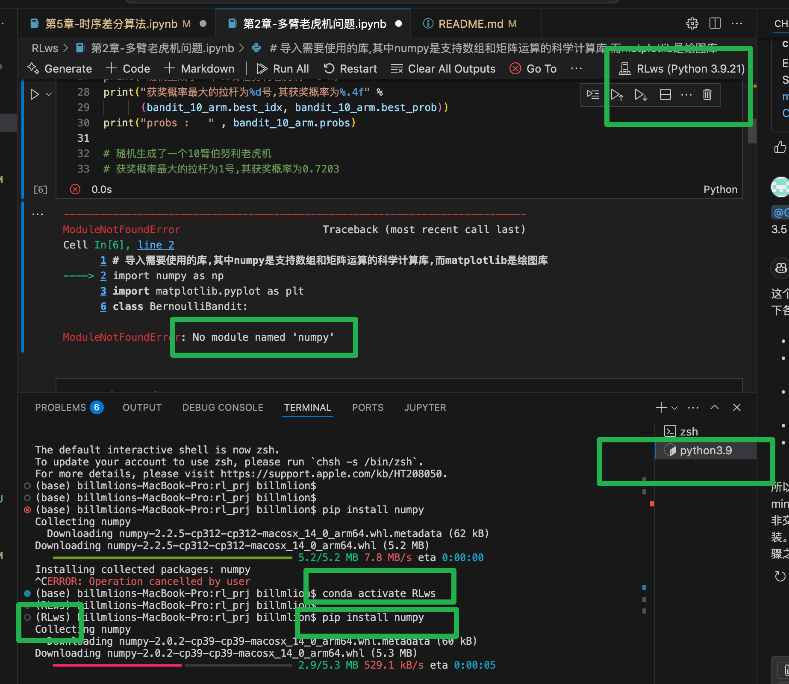

# 动手学强化学习

Tips: 若运行gym环境的代码时遇到报错，请尝试pip install gym==0.18.3安装此版本的gym库，若仍有问题，欢迎提交issue！

mac installment steps
1、install miniconda3

mkdir -p ~/miniconda3  

curl https://repo.anaconda.com/miniconda/Miniconda3-latest-MacOSX-arm64.sh -o ~/miniconda3/miniconda.sh

在vscode中，注意terminal选择bash环境
bash ~/miniconda3/miniconda.sh -b -u -p ~/miniconda3

rm ~/miniconda3/miniconda.sh

2、~/miniconda3/bin/conda init 关闭并重新打开当前的 shell

 source ~/.bash_profile

3、conda create --name RLws python=3.9 -y

4、conda activate RLws

在新的RLws虚拟环境下操作，安装以下中间件

0、python==3.9

1、pip install torch==2.3.0

2、pip uninstall gym

3、pip install gym==0.25.2

 vscode 虚拟环境内中间件配置
